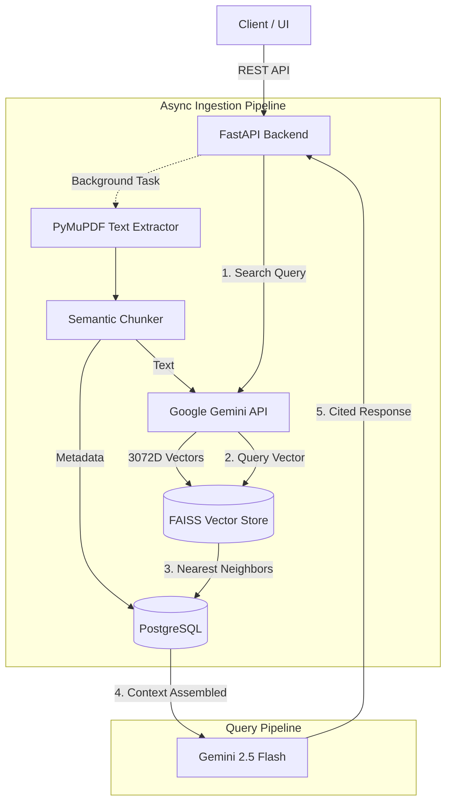

# 🧠 Smart Search: Intelligent Multi-Tenant RAG Agent


> A production-grade, multi-tenant Retrieval-Augmented Generation (RAG) system built to intelligently query and synthesize knowledge from documents. Designed with a focus on advanced AI/ML architecture, data privacy, and high-performance vector search.

---

## 🌟 Project Highlights

This project was engineered from the ground up to demonstrate end-to-end expertise in modern AI/ML pipelines, specifically focusing on **Natural Language Processing (NLP)** and **Information Retrieval**.

- **Semantic Understanding**: Uses dense vector embeddings (`models/gemini-embedding-2`, 3072 dimensions) to understand the *meaning* of queries, moving beyond traditional keyword search.
- **High-Speed Inference**: Powered by the state-of-the-art `gemini-2.5-flash` LLM for rapid, context-aware synthesis.
- **Multi-Tenant Architecture**: Strict logical isolation of vector indices (FAISS) and relational data (PostgreSQL) ensuring data privacy across different users and organizations.
- **Asynchronous Ingestion**: Non-blocking background tasks handle PDF parsing, chunking, and embedding generation, allowing the API to remain highly responsive.

## 🏗️ Architecture Overview



## 🛠️ Tech Stack

| Component | Technology | Purpose |
| --- | --- | --- |
| **Framework** | FastAPI | High-performance async REST API with automatic OpenAPI documentation. |
| **Database** | PostgreSQL + SQLAlchemy | Relational persistence for Users, Auth, Chunk Metadata, and Query Logs. |
| **Vector Store** | FAISS | High-speed, in-memory Nearest Neighbor (k-NN) similarity search. |
| **AI Models** | Google Gemini API | `gemini-embedding-2` for 3072D embeddings; `gemini-2.5-flash` for generation. |
| **Authentication**| OAuth2 + JWT | Secure, stateless multi-tenant authentication. |

## 🚀 Getting Started

1. **Clone the repository**
   ```bash
   git clone https://github.com/your-username/knowra.git
   cd knowra
   ```

2. **Configure environment variables**
   ```bash
   cp .env.example .env
   # Edit .env and insert your GEMINI_API_KEY
   ```

3. **Deploy with Docker**
   ```bash
   # Spins up the FastAPI web server and PostgreSQL database
   docker-compose up --build -d
   ```

## 🔌 API Reference

| Method | Route | Auth | Description |
| --- | --- | --- | --- |
| `POST` | `/auth/register` | None | Register a new user and create an organization. |
| `POST` | `/auth/login` | None | Authenticate and retrieve a JWT Bearer token. |
| `POST` | `/documents/upload` | User | Upload a PDF. Triggers async vector embedding pipeline. |
| `GET` | `/documents` | User | Retrieve all processed documents for the organization. |
| `POST` | `/query` | User | Submit a natural language query against the vector database. |

## 🧠 Deep Dive: How It Works

### Multi-Tenancy in Vector Space
FAISS does not natively support tenant partitioning. To solve this, the system implements a **Logical Isolation Strategy**:
- A separate `.index` file is dynamically created and loaded for each `organization_id` on disk.
- Relational chunks in PostgreSQL are strictly partitioned using foreign keys, preventing cross-tenant data leakage during the context assembly phase.

### Handling High-Dimensional Data
The system was recently upgraded to support Google's latest embedding models. By expanding the FAISS index architecture from 768 to **3072 dimensions**, the system captures significantly deeper semantic nuances, resulting in highly accurate context retrieval even for complex or poorly-phrased user queries.

---
*Built as a showcase of modern AI/ML engineering and production-ready backend design.*
